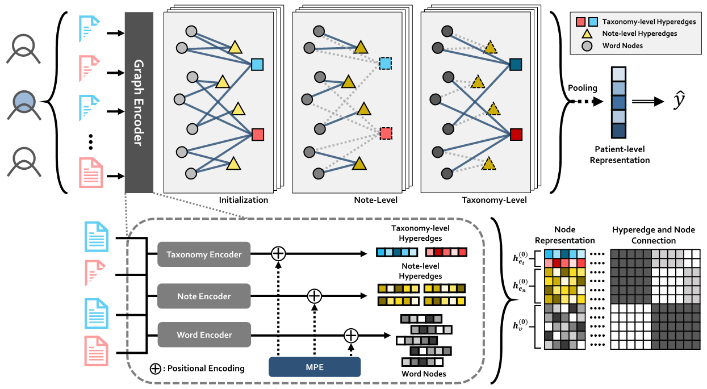

# TM-HGNN

[ACL 2023 Oral] Clinical Note Owns its Hierarchy: Multi-Level Hypergraph Neural Networks for Patient-Level Representation Learning [[Paper](https://aclanthology.org/2023.acl-long.305/)]


Leveraging knowledge from electronic health records (EHRs) to predict a patient{'}s condition is essential to the effective delivery of appropriate care. Clinical notes of patient EHRs contain valuable information from healthcare professionals, but have been underused due to their difficult contents and complex hierarchies. Recently, hypergraph-based methods have been proposed for document classifications. Directly adopting existing hypergraph methods on clinical notes cannot sufficiently utilize the hierarchy information of the patient, which can degrade clinical semantic information by (1) frequent neutral words and (2) hierarchies with imbalanced distribution. Thus, we propose a taxonomy-aware multi-level hypergraph neural network (TM-HGNN), where multi-level hypergraphs assemble useful neutral words with rare keywords via note and taxonomy level hyperedges to retain the clinical semantic information. The constructed patient hypergraphs are fed into hierarchical message passing layers for learning more balanced multi-level knowledge at the note and taxonomy levels. We validate the effectiveness of TM-HGNN by conducting extensive experiments with MIMIC-III dataset on benchmark in-hospital-mortality prediction.

## Requirements

- CUDA=11.3
- cuDNN=8.2.0
- python=3.9.12
- pandas=1.4.2
- torch=1.11.0
- torch_geometric=2.1.0

## Usage
We follow [MIMIC-III Benchmark (Harutyunyan et al.)](https://www.nature.com/articles/s41597-019-0103-9) for preprocess clinical notes.
The preprocessed NOTEEVENTS data for <code>in-hospital-mortality</code> should be in <code>data/DATA_RAW/in-hospital-mortality</code>, divided into two folders (<code>train_note</code> and <code>test_note</code>).

<!-- ### Setup
```bash
pip install -r requirements.txt
``` -->

### Prepare Notes 
```bash 
python graph_construction/prepare_notes/extract_cleaned_notes.py
python graph_construction/prepare_notes/create_hyper_df.py
```
<code>extract_cleaned_notes.py</code> cleans clinical notes in <code>data/DATA_RAW/in-hospital-mortality</code>, which results in column "Fixed TEXT" in each csv file. Word2vec token embeddings with 100 dimensions are created and saved in <code>data/DATA_RAW/root/word2vec_100</code>.

<code>create_hyper_df.py</code> creates dataframe from <code>data/DATA_RAW/in-hospital-mortality</code> where each row represents each word. The results are stored in <code>data/DATA_PRE/in-hospital-mortality</code>, divided into two folders (<code>train_hyper</code> and <code>test_hyper</code>).

### Construct Multi-level Hypergraphs
```bash
python graph_construction/prepare_notes/PygNotesGraphDataset.py --split train
python graph_construction/prepare_notes/PygNotesGraphDataset.py --split test
```
<code>PygNotesGraphDataset.py</code> creates multi-level hypergraphs with cutoff in <code>data/IMDB_HCUT/in-hospital-mortality</code>. 


### Model Train
```bash
python tmhgnn/train.py
```

### Citation
```bash
@inproceedings{kim-etal-2023-clinical,
    title = "Clinical Note Owns its Hierarchy: Multi-Level Hypergraph Neural Networks for Patient-Level Representation Learning",
    author = "Kim, Nayeon  and  Piao, Yinhua  and  Kim, Sun",
    booktitle = "Proceedings of the 61st Annual Meeting of the Association for Computational Linguistics (Volume 1: Long Papers)",
    month = jul,
    year = "2023",
    address = "Toronto, Canada",
    publisher = "Association for Computational Linguistics",
    url = "https://aclanthology.org/2023.acl-long.305",
    doi = "10.18653/v1/2023.acl-long.305",
    pages = "5559--5573",
}
```
